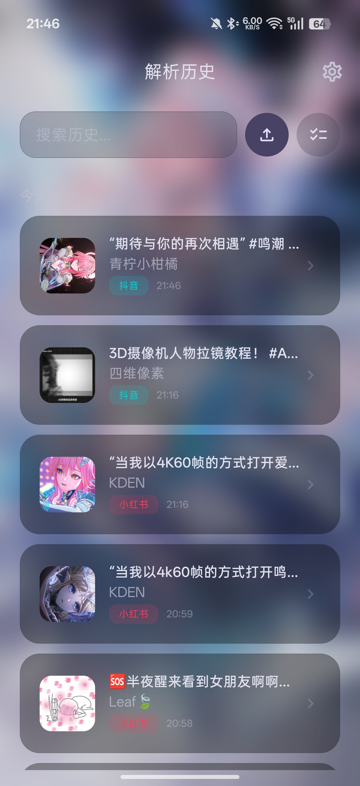
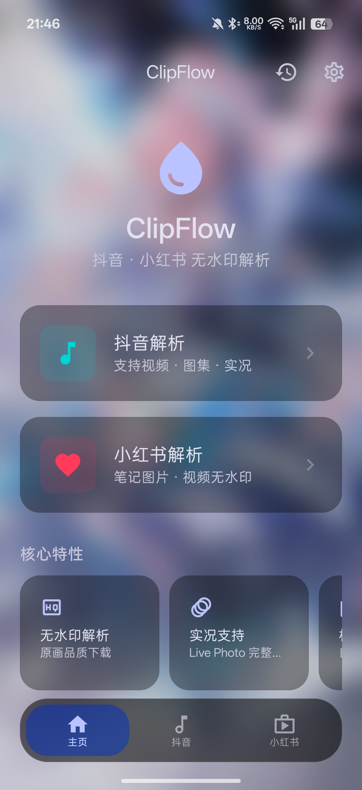
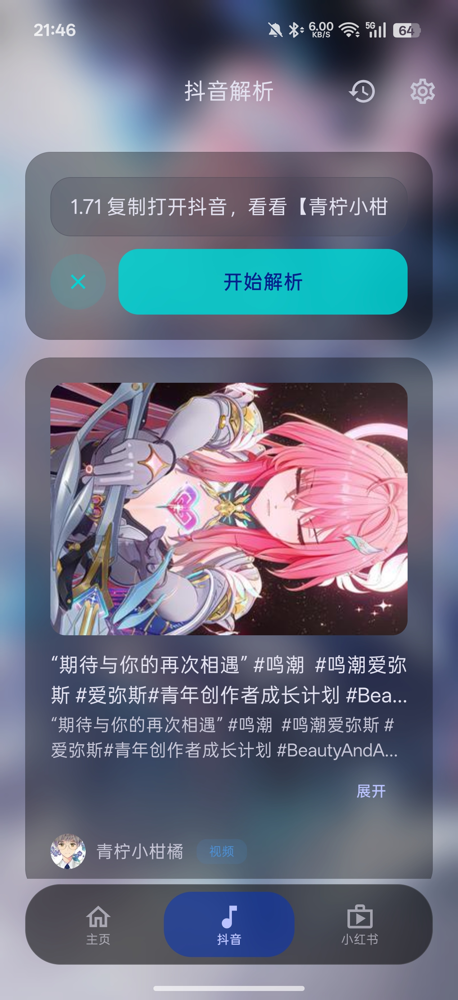
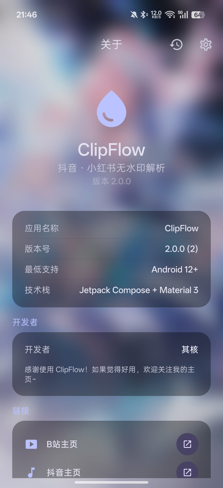

# ClipFlow

> 抖音 · 小红书无水印解析下载工具

ClipFlow 是一款 Android 平台的无水印短视频/图集解析下载工具，支持**抖音**和**小红书**两大平台。粘贴分享链接即可解析出无水印视频、图片和实况照片，一键下载到本地相册。

<p align="center">
  <table>
    <tr>
      <td align="center"><b>📜 解析历史</b></td>
      <td align="center"><b>🏠 首页</b></td>
    </tr>
    <tr>
      <td></td>
      <td></td>
    </tr>
    <tr>
      <td align="center"><b>🔍 解析结果</b></td>
      <td align="center"><b>ℹ️ 关于页面</b></td>
    </tr>
    <tr>
      <td></td>
      <td></td>
    </tr>
  </table>
</p>

---

## ✨ 功能特性

### 抖音
- 🎬 **无水印视频解析** — 粘贴抖音分享链接，自动提取无水印视频链接（[原画]）
- 📦 **多清晰度选择** — 提供主链接 + 备用链接（标注 720p/1080p 等清晰度和 H.264/H.265 编码）
- 🖼️ **图集 / 实况下载** — 支持图集批量下载和 Live Photo 实况图片+视频
- 👤 **作者信息展示** — 显示作者头像、昵称、作品标题
- 💾 **长按封面保存** — 长按封面图可直接保存到相册

### 小红书
- 📹 **无水印视频解析** — 提取无水印视频链接
- 🖼️ **图集解析** — 支持多图笔记，每张图片独立下载
- 📝 **笔记文案展示** — 显示完整笔记内容，超长文案可折叠/展开
- 👤 **作者信息展示** — 显示作者头像、昵称、笔记标题
- 🏷️ **[有水印] 标注** — 备用下载链接清晰标注 [有水印]
- 💾 **长按封面保存** — 长按封面图可直接保存到相册

### 通用
- 📋 **剪贴板粘贴** — 一键从剪贴板粘贴链接
- 📜 **历史记录** — 自动记录解析历史，支持按平台筛选
- 🌓 **Material 3 设计** — 毛玻璃效果 UI，实时模糊壁纸背景
- ⚡ **灵动岛药丸** — 后台下载时显示进度药丸，点击可回到下载界面
- 🔔 **下载通知** — 下载完成系统通知提醒

---

## 🛠️ 技术栈

| 类别 | 技术 |
|------|------|
| UI 框架 | Jetpack Compose + Material 3 |
| 架构 | MVVM (ViewModel + StateFlow) |
| 网络请求 | Retrofit 2 + OkHttp 4 |
| JSON 解析 | Gson |
| 图片加载 | Coil |
| 本地存储 | Room (SQLite) |
| 导航 | Navigation Compose |
| 最低 SDK | Android 12 (API 31) |
| 目标 SDK | Android 14 (API 36) |
| 语言 | Kotlin |

---

## 📦 构建指南

### 环境要求
- Android Studio Hedgehog (2023.1.1) 或更高
- JDK 17
- Gradle 8.4（项目自带 wrapper）

### 构建步骤

```bash
# 1. 克隆仓库
git clone https://github.com/qihe114514/qihe-douyin.git
cd qihe-douyin

# 2. Windows 直接运行
build.bat

# 3. 或使用 Gradle
./gradlew assembleRelease
```

APK 输出路径：`app/build/outputs/apk/release/app-release.apk`

---

## 🔌 API 接口

本项目使用 [BugPk-Api](https://api.bugpk.com/) 提供的免费公开接口进行短视频解析：

- **抖音解析**：`GET/POST /api/douyin?url=<分享链接>`
- **小红书解析**：`GET /api/xhs?url=<分享链接>`

> 接口文档：[https://api.bugpk.com/doc-xhs.html](https://api.bugpk.com/doc-xhs.html)

---

## 📂 项目结构

```
ClipFlow/
├── app/
│   ├── build.gradle.kts          # 应用构建配置
│   └── src/main/
│       ├── AndroidManifest.xml
│       ├── java/com/qihe/clipflow/
│       │   ├── MainActivity.kt           # 主 Activity
│       │   ├── ClipFlowApp.kt            # Application
│       │   ├── data/
│       │   │   ├── api/                  # Retrofit API 接口 + 模型
│       │   │   ├── local/                # Room 数据库 + DAO
│       │   │   └── repository/           # 数据仓库（解析逻辑）
│       │   ├── navigation/               # 导航路由
│       │   ├── ui/
│       │   │   ├── components/           # 共享 UI 组件
│       │   │   ├── douyin/               # 抖音页面
│       │   │   ├── xiaohongshu/          # 小红书页面
│       │   │   ├── history/              # 历史记录页面
│       │   │   ├── settings/             # 设置页面
│       │   │   ├── about/                # 关于页面
│       │   │   └── theme/                # Material 3 主题
│       │   └── util/                     # 工具类（下载管理、存储）
│       └── res/                          # 资源文件
├── build.gradle.kts                      # 项目级构建配置
├── settings.gradle.kts
├── gradle.properties
├── build.bat                             # Windows 一键构建脚本
└── README.md
```

---

## 📝 版本历史

| 版本 | 日期 | 更新内容 |
|------|------|----------|
| **2.0.0** | 2026-07 | 小红书 UI 对齐抖音、笔记文案折叠展开、长按封面保存、[原画]/[有水印] 标签、视频编码检测、版本号升级 |
| 1.0.0 | 2026-06 | 首个正式版本，支持抖音+小红书无水印解析下载 |

---

## 👤 作者

**其核**

- B站：[https://space.bilibili.com/1049283248](https://space.bilibili.com/1049283248)
- 抖音：[https://www.douyin.com/user/MS4wLjABAAAAuUtKOArTFKTBm4C6o5MwDQuGMNZ9-0CWZfUay6U9wUI](https://www.douyin.com/user/MS4wLjABAAAAuUtKOArTFKTBm4C6o5MwDQuGMNZ9-0CWZfUay6U9wUI)
- GitHub：[https://github.com/qihe114514](https://github.com/qihe114514)

---

## 📄 开源协议

MIT License

---

<p align="center">Made with ❤️ by 其核</p>
