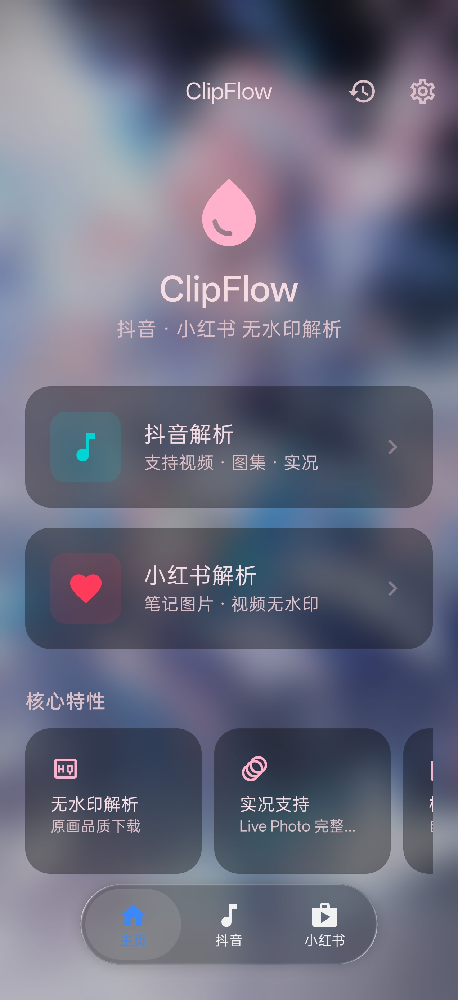
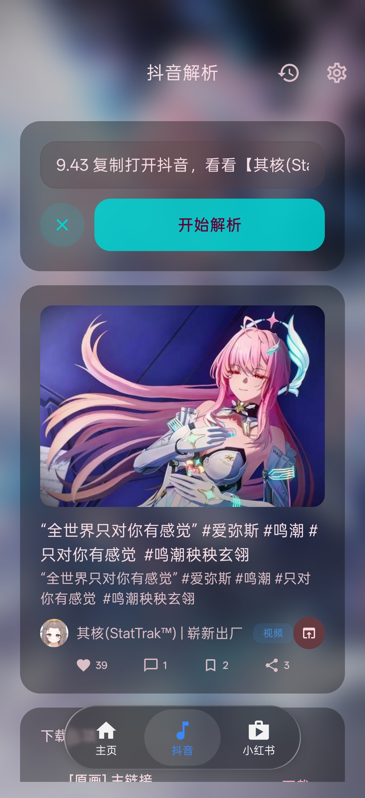
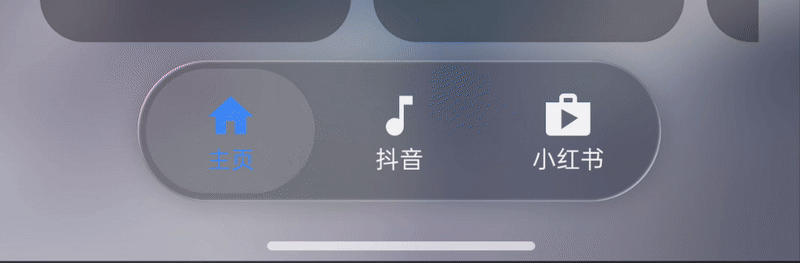

# ClipFlow

> 抖音、小红书、哔哩哔哩视频下载工具

复制分享链接，粘贴到 ClipFlow，一键解析并保存视频、图片和音乐。

  
  

  

## 下载

[下载最新版 APK](https://github.com/qihe114514/ClipFlow/releases/latest) · [查看所有版本](https://github.com/qihe114514/ClipFlow/releases)

当前版本：**v3.4**（versionCode **62**）· 最低支持：**Android 10**

## 主要功能

### 抖音 4K 原画

优先提供抖音返回的原画视频。原视频支持 4K 时，可以保留更高的清晰度和码率；相比抖音电脑端的 4K 播放版本，下载的原画文件通常更清晰。

实际清晰度取决于原视频和平台返回的资源。解析结果中标有“原画”的选项，就是优先推荐的下载选项。

抖音解析支持默认线路1和备用线路2（低清），可在解析卡片底部切换线路。

### 其他功能
| 类别 | 技术 |
|------|------|
| UI 框架 | Jetpack Compose + Material 3 |
| 架构 | MVVM (ViewModel + StateFlow) |
| 网络请求 | Retrofit 2 + OkHttp 4 |
| JSON 解析 | Gson |
| 图片加载 | Coil |
| 本地存储 | Room (SQLite) |
| 导航 | Navigation Compose |
| 最低 SDK | Android 10 (API 29) |
| 目标 SDK | API 37 |
| 语言 | Kotlin |

- 抖音、小红书无水印视频下载
- 哔哩哔哩视频解析（登录后按账号权限获取清晰度）
- 图集、实况图片和音乐下载
- 自动读取剪贴板分享链接
- 下载进度、完成通知和后台下载
- 解析历史记录，可搜索和重新打开
- 视频、图片、音乐分别保存到不同目录
- 基于 Backdrop 的渐进式顶部和底部模糊
- 支持静态背景壁纸、透明度和模糊度调整
- 关闭壁纸时使用更清晰的卡片背景和边界

## 使用方法

1. 在抖音或小红书中点击“分享” → “复制链接”。
2. 打开 ClipFlow，进入对应平台，粘贴链接并点击“开始解析”。
3. 选择“原画”或需要的内容，点击“下载”。

下载完成后，可以从系统相册、文件管理器或下载通知中打开文件。

## 默认保存位置

| 内容 | 位置 |
| --- | --- |
| 视频 | `Movies/ClipFlow` |
| 图片 | `Pictures/ClipFlow` |
| 音乐 | `Music/ClipFlow` |

可以在“设置”中分别修改保存位置，也可以更换或关闭应用背景壁纸。关闭壁纸后，卡片会切换为不依赖背景采样的深色/浅色实体背景，并保留虚线边界以提升对比度。

## 常见问题

**没有 4K 或原画选项？** 只有原视频和平台资源支持时才会出现。普通清晰度视频无法通过下载工具变成真正的 4K。

**解析失败怎么办？** 请重新复制分享链接，并确认网络正常。已删除、受限或暂时不可用的内容可能无法解析。

**安装时提示未知来源？** 在系统设置中允许当前浏览器或文件管理器安装应用，安装完成后可以关闭这项权限。

**B 站登录安全吗？** 登录会话保存在本机 Keystore 加密存储中，只用于请求当前账号有权访问的资源；退出登录或会话失效后，应用会清除本地会话和 WebView Cookie。

## 开源信息

- GitHub：[qihe114514/ClipFlow](https://github.com/qihe114514/ClipFlow)
- 主许可证：GNU General Public License v3.0（GPLv3），完整协议见 [LICENSE](LICENSE)。
- 依赖：Jetpack Compose、AndroidX、Navigation Compose、Room、DataStore、Media3、Retrofit、OkHttp、Gson、Coil、Miuix、Accompanist 和友盟 SDK 等，第三方组件按各自许可证提供。

B 站解析使用用户主动登录后获得的本地加密会话，只请求该账号有权访问的资源，不绕过付费、地区或会员限制。请只下载自己有权保存和使用的内容，并遵守相关平台的服务条款和版权规定。关于页的“开源与须知”中提供了许可证、第三方库、数据与权限、平台范围和免责声明等完整说明。
